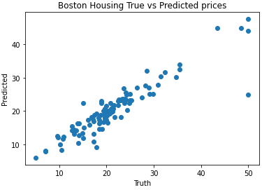
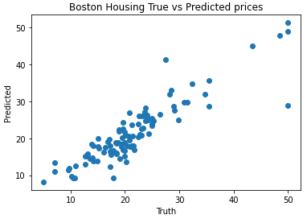

# Lab3_CNN

## Assessment 1:

  The MSE (Mean Squared Error) for the linear regression model was 14.25 while the MAE (Mean Absolute Error) for the linear regression model was 2.57. In comparison, my tuned nural network with a longer train time, additional hidden layers and a greater number of neurons had a MSE of 9.35 and an MAE of 1.96.

  The train and test results of the tuned Neural Network after adding 5 hidden layers with 128 neurons each became slightly closer. The trained results became closer to the test results, however they were not exact and the change isnt immediately noticable when looking at the values plotted on a graph.
  
  Below are the Models obtained through both approaches. The Tuned Neural Network Model is on the left and the Linear Regression Model is on the left. The code for this assessment can be found [here](https://github.com/serpawatwit/Lab3_CNN/blob/main/Boston_housing_dense_NN_using_Keras_pipeline.ipynb).

 

## Assessment 2:

  Grab a pen/paper or your favorite note-taking device and follow the examples in the video on your own.  
  
## Assessment 3:

  **Question:** If I apply pooling of 2 (2,2 window with a stride of 2) to a (6,6) array, what is the resulting size?
  **Answer:**  
